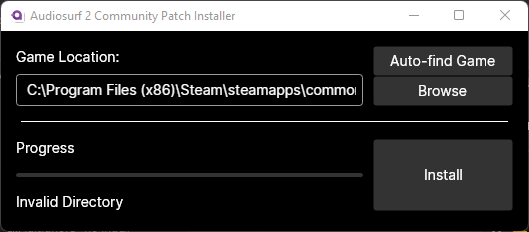
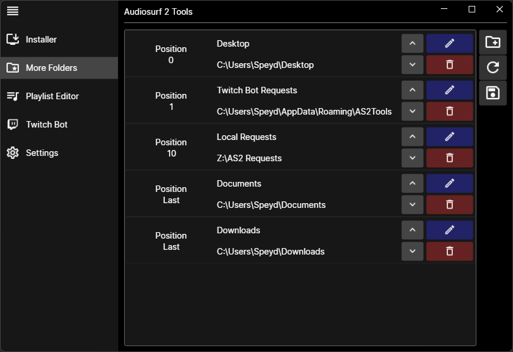
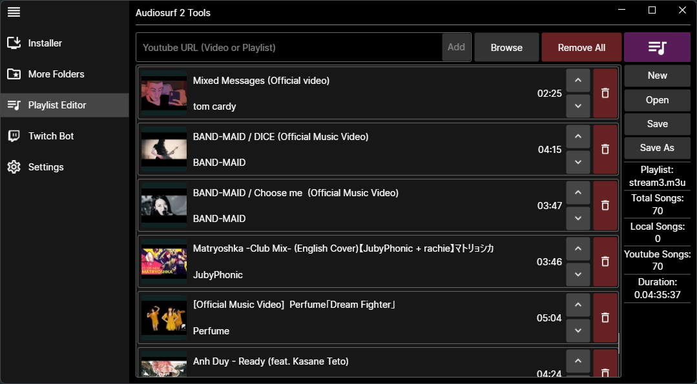
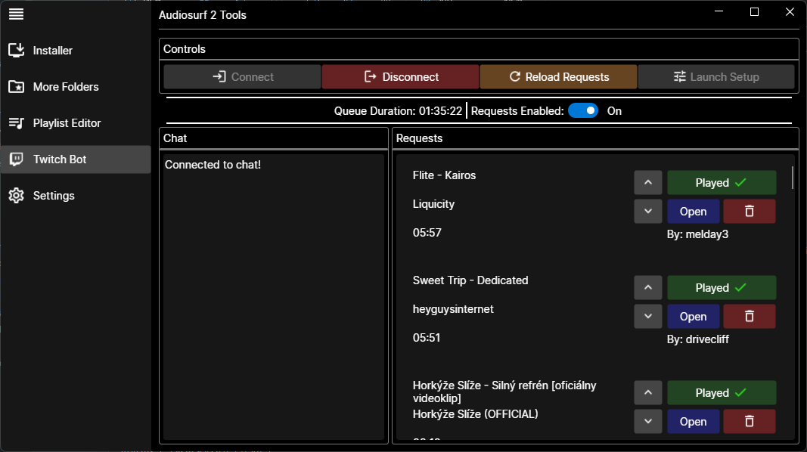

#<u> Audiosurf 2 Tools </u>

This is a small collection of tools for Audiosurf 2 (with the new Community Patch installed, some features also work in the current version).

##<u> Installer </u>

A simple installer UI to install the Community Patch (currently disabled/does nothing until the new patch is released).

##<u> MoreFolders </u>

UI to add more root paths to the Audiosurf 2 song browser (already implemented via a text file that this just edits).

##<u> Playlist Editor </u>

With the new patch Audiosurf 2 supports M3U and M3U8 playlist which can include YouTube links.
This tool makes it easy to create playlists that combine both, YouTube and local files that the game can read.

##<u> Twitch Bot </u>

A Twitch bot for (YouTube) song requests with a pop-out requests window (for use with OBS for example)

